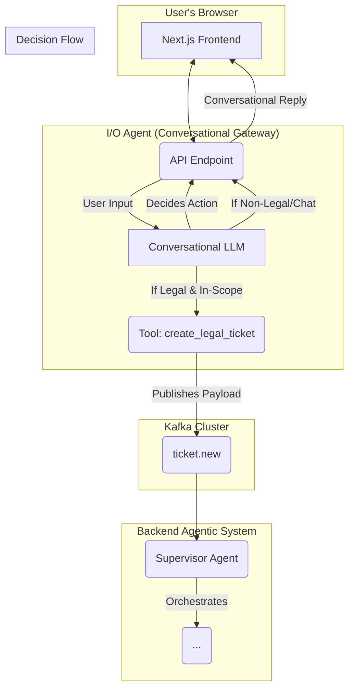
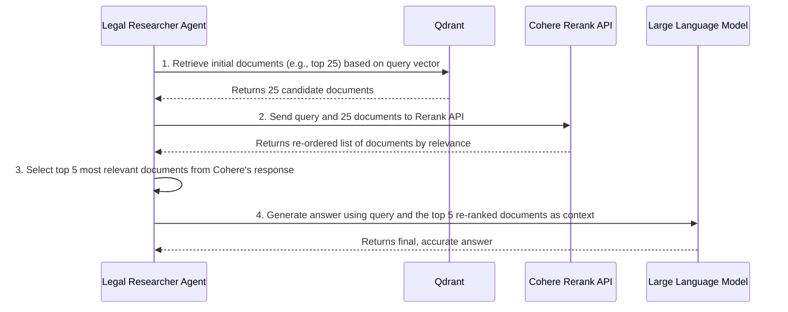

Of course. Here is the complete and final version of the Project ThemisAI System Design & Architecture document. As requested, the entire content is rewritten to provide a clean, cohesive, and definitive blueprint for your project.

---

# Project ThemisAI: System Design & Architecture

**Version:** 2.3
**Last Updated:** August 12, 2025

## Table of Contents

1.  [Project Overview](#1-project-overview)
    *   [Vision](#vision)
    *   [Core Features](#core-features)
2.  [Python Package Structure](#2-python-package-structure)
    *   [Monorepo Layout](#monorepo-layout)
    *   [Individual Service Structure](#individual-service-structure)
3.  [System Architecture](#3-system-architecture)
    *   [High-Level Diagram](#high-level-diagram)
    *   [Architectural Principles](#architectural-principles)
4.  [Technology Stack](#4-technology-stack)
5.  [Core Components (Microservices)](#5-core-components-microservices)
    *   [I/O Agent (Conversational Gateway)](#io-agent-conversational-gateway)
    *   [Supervisor Agent (Central Orchestrator)](#supervisor-agent-central-orchestrator)
    *   [Legal Researcher Agent](#legal-researcher-agent)
    *   [Legal Documents Drafter Agent](#legal-documents-drafter-agent)
    *   [Legal Documents Reviewer Agent](#legal-documents-reviewer-agent)
6.  [Data Flow & Kafka Topics](#6-data-flow--kafka-topics)
7.  [The Advanced RAG Pipeline in Detail](#7-the-advanced-rag-pipeline-in-detail)
8.  [Real-time User Experience (UX) Flow](#8-real-time-user-experience-ux-flow)
9.  [Getting Started (Developer Guide)](#9-getting-started-developer-guide)
    *   [9.1 Local Development (using Docker Compose)](#91-local-development-using-docker-compose)
    *   [9.2 Production Deployment (using Kubernetes)](#92-production-deployment-using-kubernetes)

---

## 1. Project Overview

### Vision

Project **ThemisAI** is an initiative to build a state-of-the-art, AI-powered web application that serves as an intelligent legal assistant. Our vision is to democratize access to legal knowledge by providing a guided, conversational, and accurate platform for legal research, document drafting, and compliance review within its defined domains.

### Core Features

1.  **Legal Research:** Empowers users to pose complex legal questions in natural language and receive precise answers, substantiated by citations from valid and relevant legal sources.
2.  **Legal Document Drafting:** Automatically generates drafts of common legal documents (e.g., powers of attorney, non-disclosure agreements) by synthesizing user requirements and contextual legal research.
3.  **Legal Document Review:** Analyzes user-provided legal documents to assess compliance with current laws, identify potential risks or ambiguities, and offer actionable recommendations.

---

## 2. Python Package Structure

To ensure the project is maintainable, scalable, and provides a consistent developer experience, we will adopt a structured monorepo layout. This structure clearly separates concerns and standardizes the architecture of each microservice.

### Monorepo Layout

The root of the repository is organized to separate frontend code, backend services, and infrastructure configurations, facilitating independent development and deployment pipelines.

```plaintext
themisai/
├── .github/                  # CI/CD workflows (e.g., GitHub Actions)
├── services/                 # Parent directory for all backend microservices
│   ├── io_agent/             # I/O Agent microservice package
│   ├── supervisor_agent/     # Supervisor Agent microservice package
│   ├── researcher_agent/     # Researcher Agent microservice package
│   └── ...                   # Other agent services
├── frontend/                 # The Next.js application
├── infra/                    # Infrastructure as Code (IaC)
│   ├── docker-compose.yml    # For local development
│   └── helm/                 # Helm charts for Kubernetes deployment
│       └── themisai/
├── .env.example              # Example environment variables
├── .gitignore
└── README.md                 # This file
```

### Individual Service Structure

Each Python microservice within the `services/` directory will adhere to the following standardized structure, managed with `Poetry`. This consistency is key to reducing cognitive load and accelerating development.

The structure for `supervisor_agent` serves as the template:

```plaintext
services/supervisor_agent/
├── app/                      # Main application source code, importable as a package
│   ├── __init__.py
│   ├── api/                  # FastAPI endpoints and routes (if applicable)
│   │   └── __init__.py
│   ├── core/                 # Core logic, including configuration management
│   │   ├── __init__.py
│   │   └── config.py         # Pydantic settings for loading environment variables
│   ├── schemas/              # Pydantic models defining data contracts (e.g., Kafka messages)
│   │   ├── __init__.py
│   │   └── ticket.py
│   ├── services/             # Business logic handlers (e.g., Kafka consumer/producer logic)
│   │   ├── __init__.py
│   │   └── kafka_service.py
│   ├── agent/                # The core AI logic (e.g., LangGraph graph definition)
│   │   ├── __init__.py
│   │   └── graph.py
│   └── main.py               # FastAPI application entry point and lifecycle events
├── tests/                    # Unit and integration tests for the service
│   ├── __init__.py
│   └── test_kafka_service.py
├── Dockerfile                # Multi-stage Dockerfile for building a lean production image
├── poetry.lock               # Dependency lock file for reproducible builds
└── pyproject.toml            # Project metadata and dependencies (managed by Poetry)
```

#### Key Components Explained:

*   **`app/core/config.py`**: Provides a single, validated source of truth for all environment variables using Pydantic's `BaseSettings`.
*   **`app/schemas/`**: Defines the data contracts for all inputs and outputs, ensuring data integrity across the system.
*   **`app/services/`**: Encapsulates business logic decoupled from the web framework, such as processing Kafka messages.
*   **`app/agent/`**: Contains the specialized AI logic for the agent, such as the LangGraph definition or the LlamaIndex RAG pipeline.
*   **`pyproject.toml`**: The modern standard for Python project configuration, defining dependencies, metadata, and scripts for tools like `Poetry` and `pytest`.

---

## 3. System Architecture

### High-Level Diagram



### Architectural Principles

Our architecture is guided by these core principles to ensure a robust and scalable system:

*   **Conversational Intake & Tool-Based Handoff:** The system begins with a sophisticated conversational agent (the I/O Agent). It uses an LLM to understand intent and only triggers the main backend workflow by calling a specific "tool" when a valid, in-scope legal request is identified.
*   **Independent Microservices:** Each AI Agent (Supervisor, Researcher, etc.) is a **fully independent, containerized service**. This allows teams to develop, deploy, and scale each agent's functionality without impacting the rest of the system.
*   **Asynchronous Communication:** The system is built around an event-driven model using Apache Kafka, ensuring resilience to component failures and enabling horizontal scaling.
*   **AI-Native:** The architecture is purpose-built to support sophisticated AI workflows, featuring advanced state management with LangGraph and a high-accuracy RAG pipeline.
*   **User-Centric:** User experience is paramount. Real-time status updates are implemented to provide transparency and keep the user engaged throughout the process.

---

## 4. Technology Stack

| Category | Technology | Rationale for Selection |
| :--- | :--- | :--- |
| **Backend Runtime** | **Python** & FastAPI | The industry standard for AI/ML, offering high performance and first-class asynchronous support. |
| **Frontend Runtime**| **Bun** | A modern, all-in-one JavaScript runtime and toolkit chosen for its exceptional performance and simplified developer experience. |
| **Frontend Framework**| Next.js (React) | A leading framework for building fast, modern, and SEO-friendly web applications, fully compatible with the Bun runtime. |
| **UI Library** | Shadcn/ui | A highly customizable and accessible component library for accelerating UI development. |
| **Agentic Logic** | LangGraph | Essential for orchestrating the complex, stateful, and potentially cyclical workflows of our agentic system. |
| **RAG Framework** | LlamaIndex | A comprehensive framework that simplifies and optimizes the entire RAG pipeline. |
| **Vector Database**| Qdrant | A high-performance, production-ready vector database optimized for semantic search. |
| **Reranking** | Cohere Rerank API | Delivers State-of-the-Art (SOTA) accuracy for document relevance with excellent multilingual support. |
| **Database** | PostgreSQL | A battle-tested relational database, perfect for storing structured data like tickets and user metadata. |
| **Messaging** | Apache Kafka | The definitive choice for a resilient, scalable, and high-throughput asynchronous communication backbone. |
| **Caching** | Redis | An extremely fast in-memory data store, ideal for caching frequently accessed data to reduce latency. |

---

## 5. Core Components (Microservices)

The ThemisAI backend is composed of the following specialized and **independent microservices**.

### I/O Agent (Conversational Gateway)

*   **Purpose:** To act as the intelligent, conversational "front door" to the entire system, managing user interaction and qualifying requests before engaging the main workflow.
*   **Core Logic:** This agent is powered by its own LLM instance, configured with a specific system prompt and a defined set of tools. The prompt instructs the LLM on its persona, its capabilities, and its limitations.
*   **Key Responsibilities & Workflow:**
    1.  **Conversational Intake:** All user input is first processed by this agent's LLM.
    2.  **Intent Recognition:** Using its prompting and internal logic, the LLM determines the user's intent. Is it a simple greeting? A question about the system's purpose? Or a specific legal query?
    3.  **Handle Non-Legal/Out-of-Scope Chat:** If the query is identified as non-legal, out-of-scope, or general conversation, the agent responds conversationally without triggering any backend processes. It can answer questions about itself, clarify its purpose, and gracefully guide the user toward making a valid legal request. **No ticket is created in this mode.**
    4.  **Identify In-Scope Legal Queries:** When the agent's LLM recognizes a legal problem that falls within its predefined capabilities (e.g., "draft a non-disclosure agreement," "review this contract clause"), it decides to use its specialized tool.
    5.  **Tool Calling:** The LLM invokes the `create_legal_ticket` tool. This is a predefined Python function available to the agent. The function is responsible for:
        *   Generating a unique, secure `Ticket ID`.
        *   Structuring the user's problem and conversational context into a standardized JSON payload.
        *   Publishing this payload to the `ticket.new` Kafka topic.
    6.  **Confirm Handoff:** After the `create_legal_ticket` tool executes successfully, the agent informs the user that their case has been accepted and is now being processed (e.g., "Thank you. I've created ticket #12345 and our specialized agents are now working on your request. You will see live updates below."). This is the point where the real-time SSE updates begin.

### Supervisor Agent (Central Orchestrator)

*   **Purpose:** To serve as the "brain" of the operation, managing the entire lifecycle of a user request **after it has been approved and ticketed by the I/O Agent**.
*   **Key Responsibilities:**
    1.  Utilizes **LangGraph** to model the workflow as a stateful graph.
    2.  Consumes new, validated tasks from the `ticket.new` topic.
    3.  Decomposes user problems into discrete tasks and delegates them to the appropriate specialized agents.
    4.  Publishes user-friendly status updates to the `ticket.status.updates` topic at each significant state transition.
    5.  Synthesizes findings from all agents into a single, coherent, and comprehensive final response.

### Legal Researcher Agent

*   **Purpose:** To perform deep, accurate, and citation-backed legal research.
*   **Key Responsibilities:**
    1.  Consumes research tasks from the `request.research` topic.
    2.  Executes an advanced RAG pipeline using **LlamaIndex**.
    3.  Retrieves document candidates from the **Qdrant** vector database.
    4.  Leverages the **Cohere Rerank API** to ensure the highest possible relevance of source materials.
    5.  Publishes its structured findings to the `result.research` topic.

### Legal Documents Drafter Agent

*   **Purpose:** To generate well-structured drafts of legal documents.
*   **Key Responsibilities:**
    1.  Consumes drafting tasks from the `request.drafting` topic.
    2.  Receives a rich context from the Supervisor.
    3.  Utilizes a powerful LLM to generate the document draft.
    4.  Publishes the final document to the `result.drafting` topic.

### Legal Documents Reviewer Agent

*   **Purpose:** To analyze and provide feedback on existing legal documents.
*   **Key Responsibilities:**
    1.  Consumes review tasks from the `request.review` topic.
    2.  Analyzes user-uploaded documents.
    3.  Can initiate a research sub-task via the Supervisor.
    4.  Publishes its analysis and recommendations to the `result.review` topic.

---

## 6. Data Flow & Kafka Topics

| Topic Name | Example Message Payload | Producer | Consumers |
| :--- | :--- | :--- | :--- |
| `ticket.new` | `{"ticket_id": "...", "user_query": "..."}` | I/O Agent (via Tool Call) | Supervisor Agent |
| `request.research`| `{"ticket_id": "...", "research_task": "..."}` | Supervisor Agent | Legal Researcher |
| `result.research` | `{"ticket_id": "...", "summary": "...", "sources": [...]}` | Legal Researcher | Supervisor Agent |
| `ticket.status.updates`| `{"ticket_id": "...", "status_message": "..."}` | Supervisor Agent | I/O Agent (SSE) |
| `system.logs` | `{"timestamp": "...", "service": "...", "level": "..."}` | All Agents | Logging Service (ELK/Loki) |

---

## 7. The Advanced RAG Pipeline in Detail

Our research pipeline is designed for maximum accuracy by combining vector search and reranking.



1.  **Initial Retrieval:** Fetches a large number of candidate documents from Qdrant to ensure no critical information is missed.
2.  **Reranking Layer:** Uses Cohere's advanced model to filter out "noise" and identify the most semantically relevant documents from the initial candidates.
3.  **Context Augmentation:** Only the most relevant documents post-reranking are used as context for the LLM.
4.  **Generation:** The LLM produces a much more accurate and focused answer because its context is clean and highly relevant.

---

## 8. Real-time User Experience (UX) Flow

The user's journey is designed for clarity and transparency.

1.  **Conversational Intake:** The user starts a conversation. The UI is a standard chat interface.
2.  **Initial Interaction:** The I/O Agent engages in conversation. If the user asks "What can you do?", it explains its capabilities. If the user says "Hello", it responds politely. This phase is fully handled by the I/O Agent.
3.  **Handoff Point:** The user asks a valid legal question like, "Can you draft an NDA for a software project?"
4.  **Tool Call & Confirmation:** The I/O Agent recognizes this as an in-scope task. The UI might show a brief "Thinking..." indicator. Then, the agent responds: "Certainly. I can help with that. I'm creating a ticket to begin the drafting process. You'll see live progress below."
5.  **Workflow Updates:** The UI now switches to receiving SSE updates, showing the backend progress:
    *   `✅ Ticket #56789 created.`
    *   `⏳ Researching standard NDA clauses...`
    *   `✍️ Drafting your document...`
6.  **Final Result:** Once the workflow is complete, the final, detailed answer and the drafted document are displayed.

---

## 9. Getting Started (Developer Guide)

### 9.1 Local Development (using Docker Compose)

This setup uses Docker Compose to orchestrate the entire application stack locally. The `docker-compose.yml` file is configured to **pull official Docker images for all infrastructure components** (PostgreSQL, Kafka, etc.) and build images for our custom services.

#### Prerequisites
*   Git
*   Docker & Docker Compose
*   **Bun** (for managing the frontend locally)
*   Python 3.10+ & Poetry (for managing backend services)
*   API Keys for external services (Cohere, OpenAI/Anthropic, etc.)

#### Configuration
1.  **Clone the Repository:**
    ```bash
    git clone <your-repository-url>
    cd themisai
    ```
2.  **Create Environment File:**
    Copy the example `.env.example` file to `.env`.
    ```bash
    cp .env.example .env
    ```
3.  **Edit Environment File:**
    Open the `.env` file and populate all required variables.

#### Running the System
1.  **Start All Services:**
    From the project's root directory, launch all services in detached mode.
    ```bash
    docker-compose up -d --build
    ```
2.  **Verify Services:**
    Check the status of all running containers.
    ```bash
    docker-compose ps
    ```
3.  **Access the Application:**
    Open your browser and navigate to `http://localhost:3000`.

#### Frontend Development with Bun

The frontend service is powered by Bun. To work on it locally:
1.  Navigate to the frontend directory: `cd frontend`
2.  Install dependencies using Bun's fast package manager: `bun install`
3.  Run the development server: `bun run dev`

#### Frontend Dockerfile Example (`frontend/Dockerfile`)

The Dockerfile for the frontend service must be updated to use Bun's official image and commands.

```Dockerfile
# Stage 1: Install dependencies
FROM oven/bun:1.0 as deps
WORKDIR /app

# Copy package.json and bun.lockb to leverage Docker cache
COPY package.json bun.lockb ./
RUN bun install --frozen-lockfile

# Stage 2: Build the application
FROM deps as builder
WORKDIR /app
COPY . .
RUN bun run build

# Stage 3: Production image
FROM oven/bun:1.0 as runner
WORKDIR /app

COPY --from=builder /app/public ./public
COPY --from=builder /app/.next ./.next
COPY --from=builder /app/node_modules ./node_modules
COPY --from=builder /app/package.json ./package.json

EXPOSE 3000
CMD ["bun", "start"]
```

### 9.2 Production Deployment (using Kubernetes)

This method outlines deploying **ThemisAI** to a production-grade Kubernetes cluster using Helm.

#### Prerequisites
*   `kubectl` configured to access your Kubernetes cluster.
*   `helm` (v3+) installed.

#### Configuration
1.  **Create a Namespace:**
    Isolate the application within its own namespace.
    ```bash
    kubectl create namespace themisai
    ```
2.  **Manage Secrets:**
    Create a Kubernetes Secret to securely store all sensitive credentials.
    ```bash
    kubectl create secret generic themisai-secrets \
      --namespace themisai \
      --from-literal=POSTGRES_PASSWORD='YOUR_SECURE_PASSWORD' \
      --from-literal=COHERE_API_KEY='YOUR_COHERE_API_KEY'
    ```

#### Deployment Steps
1.  **Add Helm Repository:**
    ```bash
    helm repo add themisai-charts <url-to-your-helm-repo>
    helm repo update
    ```
2.  **Configure `values.yaml`:**
    Create a `my-values.yaml` file to customize the deployment.
    ```yaml
    # my-values.yaml
    replicaCount: 2 # Example: scale a service
    
    secrets:
      existingSecret: themisai-secrets
    
    ingress:
      enabled: true
      hosts:
        - host: themis.your-company.com
          paths: ["/"]
    ```
3.  **Install the Helm Chart:**
    Deploy the application using your custom values.
    ```bash
    helm install themisai themisai-charts/themisai \
      --namespace themisai \
      -f my-values.yaml
    ```
