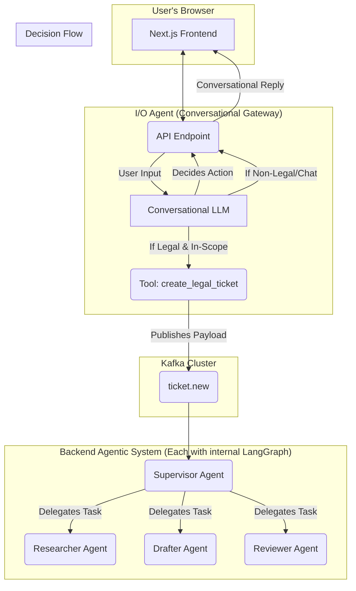

# Project ThemisAI: System Design & Architecture

**Version:** 2.5
**Last Updated:** August 12, 2025

## Table of Contents

1.  [Project Overview](#1-project-overview)
    *   [Vision](#vision)
    *   [Core Features](#core-features)
2.  [Python Package Structure](#2-python-package-structure)
    *   [Monorepo Layout](#monorepo-layout)
    *   [Individual Service Structure](#individual-service-structure)
3.  [System Architecture](#3-system-architecture)
    *   [High-Level Diagram](#high-level-diagram)
    *   [Architectural Principles](#architectural-principles)
4.  [Technology Stack](#4-technology-stack)
5.  [Core Components (Microservices)](#5-core-components-microservices)
    *   [I/O Agent (Conversational Gateway)](#io-agent-conversational-gateway)
    *   [Supervisor Agent (High-Level Orchestrator)](#supervisor-agent-high-level-orchestrator)
    *   [Legal Researcher Agent (Reasoning & Research)](#legal-researcher-agent-reasoning--research)
    *   [Legal Documents Drafter Agent (Structured Drafting)](#legal-documents-drafter-agent-structured-drafting)
    *   [Legal Documents Reviewer Agent (Analytical Review)](#legal-documents-reviewer-agent-analytical-review)
6.  [Data Flow & Kafka Topics](#6-data-flow--kafka-topics)
7.  [The Advanced RAG Pipeline in Detail](#7-the-advanced-rag-pipeline-in-detail)
8.  [Real-time User Experience (UX) Flow](#8-real-time-user-experience-ux-flow)
9.  [Getting Started (Developer Guide)](#9-getting-started-developer-guide)
    *   [9.1 Local Development (using Docker Compose)](#91-local-development-using-docker-compose)
    *   [9.2 Production Deployment (using Kubernetes)](#92-production-deployment-using-kubernetes)

---

## 1. Project Overview

### Vision

Project **ThemisAI** is an initiative to build a state-of-the-art, AI-powered web application that serves as an intelligent legal assistant. Our vision is to democratize access to legal knowledge by providing a guided, conversational, and accurate platform for legal research, document drafting, and compliance review within its defined domains.

### Core Features

1.  **Legal Research:** Empowers users to pose complex legal questions in natural language and receive precise answers, substantiated by citations from valid and relevant legal sources.
2.  **Legal Document Drafting:** Automatically generates drafts of common legal documents (e.g., powers of attorney, non-disclosure agreements) by synthesizing user requirements and contextual legal research.
3.  **Legal Document Review:** Analyzes user-provided legal documents to assess compliance with current laws, identify potential risks or ambiguities, and offer actionable recommendations.

---

## 2. Python Package Structure

To ensure the project is maintainable, scalable, and provides a consistent developer experience, we will adopt a structured monorepo layout. This structure clearly separates concerns and standardizes the architecture of each microservice.

### Monorepo Layout

The root of the repository is organized to separate frontend code, backend services, and infrastructure configurations, facilitating independent development and deployment pipelines.

```plaintext
themisai/
├── .github/                  # CI/CD workflows (e.g., GitHub Actions)
├── services/                 # Parent directory for all backend microservices
│   ├── io_agent/             # I/O Agent microservice package
│   ├── supervisor_agent/     # Supervisor Agent microservice package
│   ├── researcher_agent/     # Researcher Agent microservice package
│   └── ...                   # Other agent services
├── frontend/                 # The Next.js application
├── infra/                    # Infrastructure as Code (IaC)
│   ├── docker-compose.yml    # For local development
│   └── helm/                 # Helm charts for Kubernetes deployment
│       └── themisai/
├── .env.example              # Example environment variables
├── .gitignore
└── README.md                 # This file
```

### Individual Service Structure

Each Python microservice within the `services/` directory will adhere to the following standardized structure, managed with `Poetry`. This consistency is key to reducing cognitive load and accelerating development.

The structure for `supervisor_agent` serves as the template:

```plaintext
services/supervisor_agent/
├── app/                      # Main application source code, importable as a package
│   ├── __init__.py
│   ├── api/                  # FastAPI endpoints and routes (if applicable)
│   │   └── __init__.py
│   ├── core/                 # Core logic, including configuration management
│   │   ├── __init__.py
│   │   └── config.py         # Pydantic settings for loading environment variables
│   ├── schemas/              # Pydantic models defining data contracts (e.g., Kafka messages)
│   │   ├── __init__.py
│   │   └── ticket.py
│   ├── services/             # Business logic handlers (e.g., Kafka consumer/producer logic)
│   │   ├── __init__.py
│   │   └── kafka_service.py
│   ├── agent/                # The core AI logic (e.g., LangGraph graph definition)
│   │   ├── __init__.py
│   │   └── graph.py
│   └── main.py               # FastAPI application entry point and lifecycle events
├── tests/                    # Unit and integration tests for the service
│   ├── __init__.py
│   └── test_kafka_service.py
├── Dockerfile                # Multi-stage Dockerfile for building a lean production image
├── poetry.lock               # Dependency lock file for reproducible builds
└── pyproject.toml            # Project metadata and dependencies (managed by Poetry)
```

#### Key Components Explained:

*   **`app/core/config.py`**: Provides a single, validated source of truth for all environment variables using Pydantic's `BaseSettings`.
*   **`app/schemas/`**: Defines the data contracts for all inputs and outputs, ensuring data integrity across the system.
*   **`app/services/`**: Encapsulates business logic decoupled from the web framework, such as processing Kafka messages.
*   **`app/agent/graph.py`**: **Crucially, this file defines the internal reasoning graph for each agent using LangGraph.**
*   **`pyproject.toml`**: The modern standard for Python project configuration, defining dependencies, metadata, and scripts for tools like `Poetry` and `pytest`.

---

## 3. System Architecture

### High-Level Diagram



### Architectural Principles

Our architecture is guided by these core principles to ensure a robust and scalable system:

*   **Distributed Reasoning with LangGraph:** **Every backend AI agent** (Supervisor, Researcher, Drafter, Reviewer) employs its own internal LangGraph. This distributes reasoning capabilities, allowing each specialized agent to perform complex, multi-step tasks with internal logic, state management, and self-correction loops. This moves beyond simple tool use to a model of expert delegation.
*   **Conversational Intake & Tool-Based Handoff:** The system begins with a sophisticated conversational agent (the I/O Agent) that uses an LLM to understand intent and only triggers the main backend workflow by calling a specific "tool" when a valid, in-scope legal request is identified.
*   **Independent Microservices:** Each AI Agent is a **fully independent, containerized service**. This allows teams to develop, deploy, and scale each agent's functionality without impacting the rest of the system.
*   **Asynchronous Communication:** The system is built around an event-driven model using Apache Kafka, ensuring resilience to component failures and enabling horizontal scaling.

---

## 4. Technology Stack

| Category | Technology | Rationale for Selection |
| :--- | :--- | :--- |
| **Backend Runtime** | **Python** & FastAPI | The industry standard for AI/ML, offering high performance and first-class asynchronous support. |
| **Frontend Runtime**| **Bun** | A modern, all-in-one JavaScript runtime and toolkit chosen for its exceptional performance and simplified developer experience. |
| **Frontend Framework**| Next.js (React) | A leading framework for building fast, modern, and SEO-friendly web applications, fully compatible with the Bun runtime. |
| **UI Library** | Shadcn/ui | A highly customizable and accessible component library for accelerating UI development. |
| **Core Agentic Logic**| **LangGraph** | **The core framework for implementing the internal state machines and reasoning graphs for all backend AI agents.** |
| **RAG Framework** | LlamaIndex | A comprehensive framework that simplifies and optimizes the entire RAG pipeline, often used as a component within a LangGraph node. |
| **Vector Database**| Qdrant | A high-performance, production-ready vector database optimized for semantic search. |
| **Reranking** | Cohere Rerank API | Delivers State-of-the-Art (SOTA) accuracy for document relevance with excellent multilingual support. |
| **Database** | PostgreSQL | A battle-tested relational database, perfect for storing structured data like tickets and user metadata. |
| **Messaging** | Apache Kafka | The definitive choice for a resilient, scalable, and high-throughput asynchronous communication backbone. |
| **Caching** | Redis | An extremely fast in-memory data store, ideal for caching frequently accessed data to reduce latency. |

---

## 5. Core Components (Microservices)

The ThemisAI backend is composed of the following specialized and **independent microservices**, each with its own internal reasoning capabilities.

### I/O Agent (Conversational Gateway)

*   **Purpose:** To act as the intelligent, conversational "front door" to the entire system. **This is the only agent that does not use LangGraph**, as its role is purely conversational and stateless handoff.
*   **Core Logic & Workflow:**
    1.  **Conversational Intake:** All user input is processed by this agent's LLM.
    2.  **Intent Recognition & Chat:** It handles all non-legal and out-of-scope conversation directly.
    3.  **Tool Calling:** When it identifies an in-scope legal query, it invokes the `create_legal_ticket` tool, which publishes the task to Kafka.
    4.  **Confirm Handoff:** It confirms ticket creation with the user, at which point the real-time SSE updates from the backend system begin.

### Supervisor Agent (High-Level Orchestrator)

*   **Purpose:** To manage the high-level lifecycle of a user request after it has been ticketed.
*   **LangGraph Implementation:** Its graph is responsible for macro-level orchestration. Nodes in its graph represent high-level states like `AWAITING_RESEARCH`, `AWAITING_DRAFT`, `PENDING_FINAL_REVIEW`. Its edges are conditional, routing the overall task based on the results from the specialized agents. It delegates complex micro-tasks, but does not perform them itself.

### Legal Researcher Agent (Reasoning & Research)

*   **Purpose:** To perform deep, accurate, and citation-backed legal research as a multi-step process.
*   **LangGraph Implementation:** It uses its own internal LangGraph to manage a sophisticated research process. This is not a simple linear task. Its graph can include nodes and conditional edges for:
    *   `Query Analysis`: Deconstructing the user's request.
    *   `Sub-Query Decomposition`: Breaking a complex question into smaller, researchable parts.
    *   `Parallel RAG Execution`: Running the RAG pipeline (retrieve, rerank, synthesize) for each sub-query.
    *   `Self-Critique & Refinement`: A final node that reviews the synthesized answer against the original request, potentially looping back to refine the research if gaps are found.

### Legal Documents Drafter Agent (Structured Drafting)

*   **Purpose:** To generate well-structured drafts of legal documents in a robust, step-by-step manner.
*   **LangGraph Implementation:** It employs LangGraph to structure the drafting process, moving beyond a single LLM call. Its graph may involve nodes for:
    *   `Outline Generation`: Creating a high-level structure for the document.
    *   `Sectional Drafting`: Drafting individual sections (e.g., "Preamble," "Definitions," "Clauses") in sequence or parallel.
    *   `Consistency Check`: A node that reviews the entire draft to ensure consistent terminology and cross-referencing.
    *   `Final Formatting`: Applying final formatting rules.

### Legal Documents Reviewer Agent (Analytical Review)

*   **Purpose:** To analyze and provide feedback on existing legal documents with a structured, multi-pass approach.
*   **LangGraph Implementation:** It leverages LangGraph to perform a methodical review. Its graph can:
    *   `Parse Document`: Break the document down into its constituent parts (sections, clauses).
    *   `Parallel Clause Analysis`: Create parallel tasks to analyze each clause for specific issues (e.g., ambiguity, compliance, enforceability). This step can call the Researcher Agent as a tool.
    *   `Synthesize Risk Report`: Aggregate all identified issues from the parallel analyses into a final, structured report for the user.

---

## 6. Data Flow & Kafka Topics

| Topic Name | Example Message Payload | Producer | Consumers |
| :--- | :--- | :--- | :--- |
| `ticket.new` | `{"ticket_id": "...", "user_query": "..."}` | I/O Agent (via Tool Call) | Supervisor Agent |
| `request.research`| `{"ticket_id": "...", "research_task": "..."}` | Supervisor Agent | Legal Researcher |
| `result.research` | `{"ticket_id": "...", "summary": "...", "sources": [...]}` | Legal Researcher | Supervisor Agent |
| `ticket.status.updates`| `{"ticket_id": "...", "status_message": "..."}` | Supervisor Agent | I/O Agent (SSE) |
| `system.logs` | `{"timestamp": "...", "service": "...", "level": "..."}` | All Agents | Logging Service (ELK/Loki) |

---

## 7. The Advanced RAG Pipeline in Detail

Our research pipeline is designed for maximum accuracy by combining vector search and reranking.


1.  **Initial Retrieval:** Fetches a large number of candidate documents from Qdrant to ensure no critical information is missed.
2.  **Reranking Layer:** Uses Cohere's advanced model to filter out "noise" and identify the most semantically relevant documents from the initial candidates.
3.  **Context Augmentation:** Only the most relevant documents post-reranking are used as context for the LLM.
4.  **Generation:** The LLM produces a much more accurate and focused answer because its context is clean and highly relevant.

---

## 8. Real-time User Experience (UX) Flow

The user's journey is designed for clarity and transparency.

1.  **Conversational Intake:** The user starts a conversation. The UI is a standard chat interface.
2.  **Initial Interaction:** The I/O Agent engages in conversation. If the user asks "What can you do?", it explains its capabilities. If the user says "Hello", it responds politely. This phase is fully handled by the I/O Agent.
3.  **Handoff Point:** The user asks a valid legal question like, "Can you draft an NDA for a software project?"
4.  **Tool Call & Confirmation:** The I/O Agent recognizes this as an in-scope task. The UI might show a brief "Thinking..." indicator. Then, the agent responds: "Certainly. I can help with that. I'm creating a ticket to begin the drafting process. You'll see live progress below."
5.  **Workflow Updates:** The UI now switches to receiving SSE updates, showing the backend progress:
    *   `✅ Ticket #56789 created.`
    *   `⏳ Researching standard NDA clauses...`
    *   `✍️ Drafting your document...`
6.  **Final Result:** Once the workflow is complete, the final, detailed answer and the drafted document are displayed.

---

## 9. Getting Started (Developer Guide)

### 9.1 Local Development (using Docker Compose)

This setup uses Docker Compose to orchestrate the entire application stack locally. The `docker-compose.yml` file is configured to **pull official Docker images for all infrastructure components** (PostgreSQL, Kafka, etc.) and build images for our custom services.

#### Prerequisites
*   Git
*   Docker & Docker Compose
*   **Bun** (for managing the frontend locally)
*   Python 3.10+ & Poetry (for managing backend services)
*   API Keys for external services (Cohere, OpenAI/Anthropic, etc.)

#### Configuration
1.  **Clone the Repository:**
    ```bash
    git clone <your-repository-url>
    cd themisai
    ```
2.  **Create Environment File:**
    Copy the example `.env.example` file to `.env`.
    ```bash
    cp .env.example .env
    ```
3.  **Edit Environment File:**
    Open the `.env` file and populate all required variables.

#### Running the System
1.  **Start All Services:**
    From the project's root directory, launch all services in detached mode.
    ```bash
    docker-compose up -d --build
    ```
2.  **Verify Services:**
    Check the status of all running containers.
    ```bash
    docker-compose ps
    ```
3.  **Access the Application:**
    Open your browser and navigate to `http://localhost:3000`.

#### Frontend Development with Bun

The frontend service is powered by Bun. To work on it locally:
1.  Navigate to the frontend directory: `cd frontend`
2.  Install dependencies using Bun's fast package manager: `bun install`
3.  Run the development server: `bun run dev`

#### Frontend Dockerfile Example (`frontend/Dockerfile`)

The Dockerfile for the frontend service must be updated to use Bun's official image and commands.

```Dockerfile
# Stage 1: Install dependencies
FROM oven/bun:1.0 as deps
WORKDIR /app

# Copy package.json and bun.lockb to leverage Docker cache
COPY package.json bun.lockb ./
RUN bun install --frozen-lockfile

# Stage 2: Build the application
FROM deps as builder
WORKDIR /app
COPY . .
RUN bun run build

# Stage 3: Production image
FROM oven/bun:1.0 as runner
WORKDIR /app

COPY --from=builder /app/public ./public
COPY --from=builder /app/.next ./.next
COPY --from=builder /app/node_modules ./node_modules
COPY --from=builder /app/package.json ./package.json

EXPOSE 3000
CMD ["bun", "start"]
```

### 9.2 Production Deployment (using Kubernetes)

This method outlines deploying **ThemisAI** to a production-grade Kubernetes cluster using Helm.

#### Prerequisites
*   `kubectl` configured to access your Kubernetes cluster.
*   `helm` (v3+) installed.

#### Configuration
1.  **Create a Namespace:**
    Isolate the application within its own namespace.
    ```bash
    kubectl create namespace themisai
    ```
2.  **Manage Secrets:**
    Create a Kubernetes Secret to securely store all sensitive credentials.
    ```bash
    kubectl create secret generic themisai-secrets \
      --namespace themisai \
      --from-literal=POSTGRES_PASSWORD='YOUR_SECURE_PASSWORD' \
      --from-literal=COHERE_API_KEY='YOUR_COHERE_API_KEY'
    ```

#### Deployment Steps
1.  **Add Helm Repository:**
    ```bash
    helm repo add themisai-charts <url-to-your-helm-repo>
    helm repo update
    ```
2.  **Configure `values.yaml`:**
    Create a `my-values.yaml` file to customize the deployment.
    ```yaml
    # my-values.yaml
    replicaCount: 2 # Example: scale a service
    
    secrets:
      existingSecret: themisai-secrets
    
    ingress:
      enabled: true
      hosts:
        - host: themis.your-company.com
          paths: ["/"]
    ```
3.  **Install the Helm Chart:**
    Deploy the application using your custom values.
    ```bash
    helm install themisai themisai-charts/themisai \
      --namespace themisai \
      -f my-values.yaml
    ```
