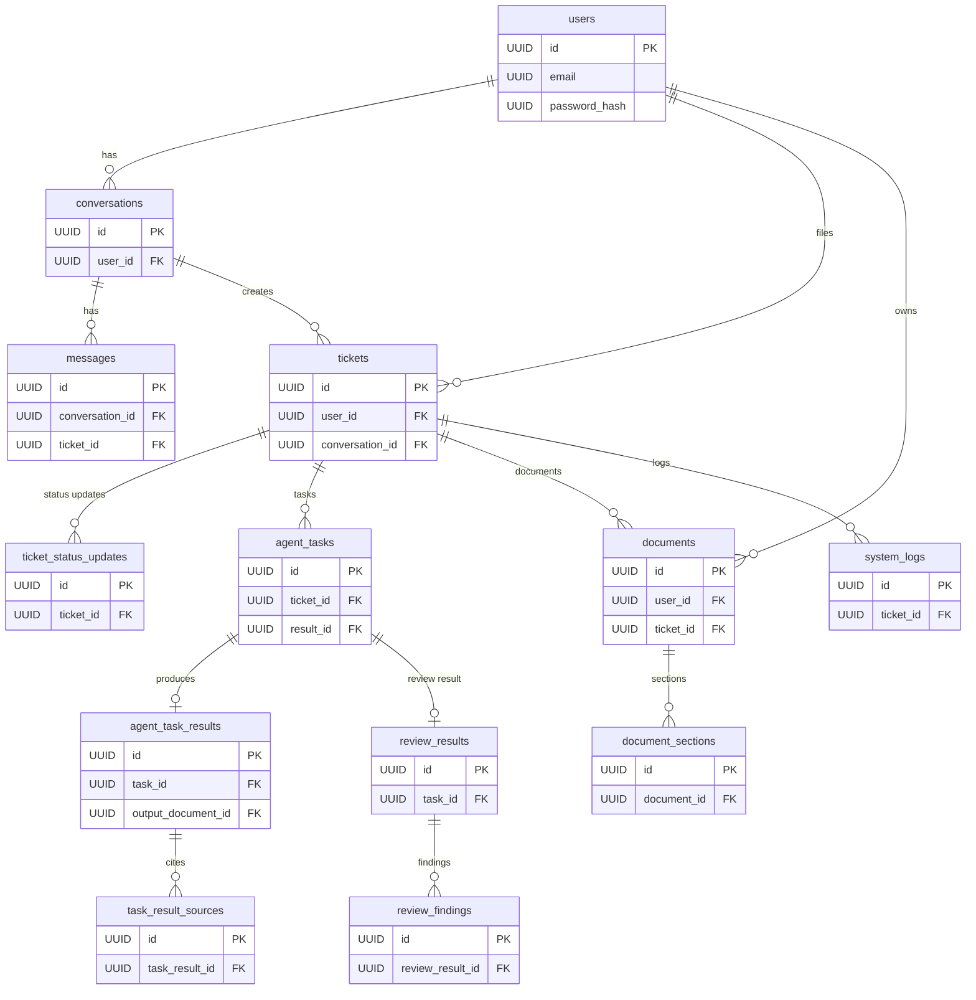

**SECTION 1: PROJECT OVERVIEW**

Project ThemisAI is an AI‑powered legal assistant that helps users research legal questions, draft legal documents and review existing documents.  The system uses a conversational gateway (I/O agent) to interact with users and, once a legal request is detected, it creates a **legal ticket**.  A supervisor agent then orchestrates that ticket by delegating work to specialist agents: a researcher agent to perform multi‑step research, a drafter agent to generate legal documents and a reviewer agent to analyse existing documents.  The technology stack calls out **PostgreSQL** as the database used for storing structured data such as tickets and user metadata.  The overall data‑flow uses Kafka topics carrying messages like `ticket.new`, `request.research`, `result.research` and `ticket.status.updates`, each of which reference a `ticket_id`, research tasks, research results (summary and sources) and status updates.

**SECTION 2: NAMING CONVENTIONS**

All tables use plural snake‑case names (e.g., `users`, `messages`).  Each table has a primary key named `id`.  Foreign keys follow the pattern `[singular_table_name]_id` (e.g., `user_id`, `ticket_id`).  Enum types are named in snake\_case (e.g., `ticket_status`).

---

### SECTION 3: CUSTOM TYPE DEFINITIONS (ENUMS)

| Type Name           | Possible Values                                                                                                  | Use                                                                               |
| ------------------- | ---------------------------------------------------------------------------------------------------------------- | --------------------------------------------------------------------------------- |
| **user\_role**      | `'user'`, `'legal_professional'`, `'admin'`                                                                      | Role of the account (standard user, internal legal professional or system admin). |
| **ticket\_status**  | `'new'`, `'in_progress'`, `'researching'`, `'drafting'`, `'reviewing'`, `'completed'`, `'cancelled'`, `'failed'` | Lifecycle status of a ticket.                                                     |
| **task\_type**      | `'research'`, `'draft_document'`, `'review'`, `'other'`                                                          | Type of internal task created by the supervisor agent.                            |
| **task\_status**    | `'pending'`, `'in_progress'`, `'completed'`, `'failed'`, `'cancelled'`                                           | Execution status of a task.                                                       |
| **agent\_type**     | `'io'`, `'supervisor'`, `'researcher'`, `'drafter'`, `'reviewer'`                                                | Identifies which type of agent a task is assigned to.                             |
| **message\_sender** | `'user'`, `'system'`, `'agent'`                                                                                  | Who sent a message in a conversation.                                             |
| **document\_type**  | `'uploaded'`, `'draft'`, `'final'`, `'reviewed'`                                                                 | Category of a stored document.                                                    |
| **source\_type**    | `'legislation'`, `'case_law'`, `'regulation'`, `'article'`, `'other'`                                            | Kind of source referenced in research results.                                    |
| **severity\_level** | `'low'`, `'medium'`, `'high'`, `'critical'`                                                                      | Severity of findings in a review.                                                 |

---

### SECTION 4: TABLE DESCRIPTIONS

### TABLE: **users**

**Purpose:** Store user accounts and authentication information.

| Column          | Type             | Key Rules                |
| --------------- | ---------------- | ------------------------ |
| id              | UUID             | Primary key              |
| email           | Text             | Required, unique         |
| password\_hash  | Text             | Required                 |
| full\_name      | Text             | Required                 |
| role            | `user_role` enum | Default `user`           |
| created\_at     | Timestamp TZ     | Default now              |
| updated\_at     | Timestamp TZ     | Default now, auto‑update |
| last\_login\_at | Timestamp TZ     | Optional                 |
| is\_active      | Boolean          | Default `true`           |

---

### TABLE: **conversations**

**Purpose:** Represent chat sessions between a user and the I/O agent.

| Column      | Type           | Key Rules   |
| ----------- | -------------- | ----------- |
| id          | UUID           | Primary key |
| user\_id    | UUID (→ users) | Required    |
| started\_at | Timestamp TZ   | Default now |
| ended\_at   | Timestamp TZ   | Optional    |
| title       | Text           | Optional    |

---

### TABLE: **messages**

**Purpose:** Store individual chat messages within a conversation.

| Column           | Type                   | Key Rules   |
| ---------------- | ---------------------- | ----------- |
| id               | UUID                   | Primary key |
| conversation\_id | UUID (→ conversations) | Required    |
| sender           | `message_sender` enum  | Required    |
| agent\_type      | `agent_type` enum      | Optional    |
| ticket\_id       | UUID (→ tickets)       | Optional    |
| content          | Long‑text              | Required    |
| created\_at      | Timestamp TZ           | Default now |

---

### TABLE: **tickets**

**Purpose:** Represent a legal request identified by the I/O agent that requires backend processing.

| Column           | Type                   | Key Rules                |
| ---------------- | ---------------------- | ------------------------ |
| id               | UUID                   | Primary key              |
| user\_id         | UUID (→ users)         | Required                 |
| conversation\_id | UUID (→ conversations) | Optional                 |
| title            | Text                   | Required                 |
| description      | Long‑text              | Optional                 |
| status           | `ticket_status` enum   | Default `new`            |
| priority         | `severity_level` enum  | Optional                 |
| created\_at      | Timestamp TZ           | Default now              |
| updated\_at      | Timestamp TZ           | Default now, auto‑update |
| closed\_at       | Timestamp TZ           | Optional                 |

---

### TABLE: **ticket\_status\_updates**

**Purpose:** Maintain a history of status changes and human‑readable updates for each ticket.

| Column             | Type                 | Key Rules   |
| ------------------ | -------------------- | ----------- |
| id                 | UUID                 | Primary key |
| ticket\_id         | UUID (→ tickets)     | Required    |
| status             | `ticket_status` enum | Required    |
| message            | Text                 | Required    |
| created\_at        | Timestamp TZ         | Default now |
| created\_by\_agent | `agent_type` enum    | Optional    |

---

### TABLE: **agent\_tasks**

**Purpose:** Represent discrete units of work delegated by the supervisor agent to specialised agents.

| Column          | Type                          | Key Rules                |
| --------------- | ----------------------------- | ------------------------ |
| id              | UUID                          | Primary key              |
| ticket\_id      | UUID (→ tickets)              | Required                 |
| type            | `task_type` enum              | Required                 |
| status          | `task_status` enum            | Default `pending`        |
| assigned\_agent | `agent_type` enum             | Required                 |
| payload         | JSON/Text                     | Required                 |
| result\_id      | UUID (→ agent\_task\_results) | Optional                 |
| created\_at     | Timestamp TZ                  | Default now              |
| updated\_at     | Timestamp TZ                  | Default now, auto‑update |
| started\_at     | Timestamp TZ                  | Optional                 |
| completed\_at   | Timestamp TZ                  | Optional                 |

---

### TABLE: **agent\_task\_results**

**Purpose:** Store outputs produced by tasks.

| Column               | Type                  | Key Rules                |
| -------------------- | --------------------- | ------------------------ |
| id                   | UUID                  | Primary key              |
| task\_id             | UUID (→ agent\_tasks) | Required                 |
| summary              | Long‑text             | Required                 |
| result\_data         | JSON/Text             | Optional                 |
| output\_document\_id | UUID (→ documents)    | Optional                 |
| created\_at          | Timestamp TZ          | Default now              |
| updated\_at          | Timestamp TZ          | Default now, auto‑update |

---

### TABLE: **task\_result\_sources**

**Purpose:** Capture the legal sources or references used to produce a research result.

| Column            | Type                          | Key Rules   |
| ----------------- | ----------------------------- | ----------- |
| id                | UUID                          | Primary key |
| task\_result\_id  | UUID (→ agent\_task\_results) | Required    |
| source\_type      | `source_type` enum            | Required    |
| source\_reference | Text                          | Required    |
| excerpt           | Long‑text                     | Optional    |
| rank              | Integer                       | Optional    |

---

### TABLE: **documents**

**Purpose:** Store user‑uploaded documents, drafts generated by the drafter agent and final reviewed documents.

| Column      | Type                 | Key Rules                |
| ----------- | -------------------- | ------------------------ |
| id          | UUID                 | Primary key              |
| user\_id    | UUID (→ users)       | Required for uploads     |
| ticket\_id  | UUID (→ tickets)     | Optional                 |
| type        | `document_type` enum | Required                 |
| name        | Text                 | Required                 |
| file\_path  | Text                 | Required                 |
| content     | Long‑text            | Optional                 |
| version     | Integer              | Default 1                |
| created\_at | Timestamp TZ         | Default now              |
| updated\_at | Timestamp TZ         | Default now, auto‑update |

---

### TABLE: **document\_sections**

**Purpose:** Provide a structured representation of drafted documents by section.

| Column       | Type               | Key Rules   |
| ------------ | ------------------ | ----------- |
| id           | UUID               | Primary key |
| document\_id | UUID (→ documents) | Required    |
| title        | Text               | Required    |
| content      | Long‑text          | Required    |
| order        | Integer            | Required    |

---

### TABLE: **review\_results**

**Purpose:** Store structured feedback produced by the reviewer agent about a document.

| Column      | Type                  | Key Rules                |
| ----------- | --------------------- | ------------------------ |
| id          | UUID                  | Primary key              |
| task\_id    | UUID (→ agent\_tasks) | Required                 |
| summary     | Long‑text             | Required                 |
| risk\_level | `severity_level` enum | Required                 |
| created\_at | Timestamp TZ          | Default now              |
| updated\_at | Timestamp TZ          | Default now, auto‑update |

---

### TABLE: **review\_findings**

**Purpose:** Represent individual issues found during document review.

| Column             | Type                     | Key Rules   |
| ------------------ | ------------------------ | ----------- |
| id                 | UUID                     | Primary key |
| review\_result\_id | UUID (→ review\_results) | Required    |
| description        | Long‑text                | Required    |
| severity           | `severity_level` enum    | Required    |
| recommendation     | Long‑text                | Optional    |
| created\_at        | Timestamp TZ             | Default now |

---

### TABLE: **system\_logs**

**Purpose:** Capture application logs and events that may need to be queried.

| Column     | Type             | Key Rules   |
| ---------- | ---------------- | ----------- |
| id         | UUID             | Primary key |
| timestamp  | Timestamp TZ     | Required    |
| service    | Text             | Required    |
| level      | Text             | Required    |
| message    | Long‑text        | Required    |
| ticket\_id | UUID (→ tickets) | Optional    |

---

### SECTION 5: RELATIONSHIP DESCRIPTIONS

#### Entity Relationship Diagram

#### Relationship Explanation

1. **User–Conversation:** A user can have many conversations.  Each conversation must belong to exactly one user (`conversations.user_id → users.id`).  Deleting a user should be restricted if they still have conversations.

2. **Conversation–Message:** A conversation can have many messages; each message must belong to exactly one conversation (`messages.conversation_id → conversations.id`).  When a conversation is deleted, cascade deletion of its messages.

3. **User–Ticket:** A user can have many tickets; each ticket belongs to one user (`tickets.user_id → users.id`).  Deleting a user should be restricted if they have existing tickets.

4. **Conversation–Ticket:** A ticket may originate from a conversation; optional relationship (`tickets.conversation_id → conversations.id`).  If a conversation is deleted, restrict deletion if tickets reference it.

5. **Ticket–Status Updates:** A ticket can have many status updates (`ticket_status_updates.ticket_id → tickets.id`).  Deletion of a ticket should cascade to its status update history.

6. **Ticket–Task:** A ticket can have many tasks, but each task belongs to exactly one ticket (`agent_tasks.ticket_id → tickets.id`).  If a ticket is deleted, cascade deletion of its tasks and their results.

7. **Task–Result:** A task may produce one result (`agent_tasks.result_id → agent_task_results.id`) and each result must be associated with a task (`agent_task_results.task_id → agent_tasks.id`).  Deleting a task should cascade deletion of its result.

8. **Result–Source:** A result can have many sources (`task_result_sources.task_result_id → agent_task_results.id`).  Deleting a result should cascade deletion of associated sources.

9. **Task–Document:** A task result may reference a document (`agent_task_results.output_document_id → documents.id`).  Deleting a document should be restricted if referenced by a result.

10. **Ticket–Document:** A ticket can have multiple associated documents (`documents.ticket_id → tickets.id`).  Deleting a ticket should cascade deletion of drafts and uploaded documents linked exclusively to that ticket.

11. **Document–Section:** A document can have many sections (`document_sections.document_id → documents.id`).  Deleting a document should cascade deletion of its sections.

12. **Task–Review Result:** Review tasks produce review results (`review_results.task_id → agent_tasks.id`).  Deleting the task should cascade deletion of its review result and findings.

13. **Review Result–Finding:** A review result can have multiple findings (`review_findings.review_result_id → review_results.id`).  Deleting a review result should cascade deletion of its findings.

14. **System Logs:** Logs may optionally reference a ticket.  Deleting a ticket should not delete system logs; rather set `ticket_id` to `NULL` if a ticket is removed.

---

### SECTION 6: INDEXING STRATEGY

| Table & Column                                                             | Reason for Indexing                                                                    |
| -------------------------------------------------------------------------- | -------------------------------------------------------------------------------------- |
| `users.email`                                                              | Enforce uniqueness and enable quick user lookups during authentication.                |
| `conversations.user_id`                                                    | Retrieve all conversations for a given user quickly.                                   |
| `messages.conversation_id`                                                 | Efficiently fetch messages belonging to a conversation.                                |
| `messages.ticket_id`                                                       | Support retrieving messages associated with a ticket during workflows.                 |
| `tickets.user_id`                                                          | Frequently query tickets by user for dashboards.                                       |
| `tickets.status`                                                           | Filter tickets by status (e.g., all “researching” tickets) and support dashboards.     |
| `ticket_status_updates.ticket_id`                                          | Quickly fetch status history for a ticket.                                             |
| `agent_tasks.ticket_id` and `agent_tasks.status`                           | Retrieve tasks belonging to a ticket and filter tasks by status (e.g., pending tasks). |
| `agent_tasks.assigned_agent`                                               | Support operational dashboards showing tasks per agent type.                           |
| `agent_task_results.task_id`                                               | Quickly find result records for tasks.                                                 |
| `task_result_sources.task_result_id`                                       | Efficient retrieval of sources when presenting research citations.                     |
| `documents.user_id` and `documents.ticket_id`                              | Search documents by user or by ticket.                                                 |
| `documents.type`                                                           | Filter documents by type (e.g., drafts vs. uploads).                                   |
| `document_sections.document_id`                                            | Quick retrieval of sections for document rendering.                                    |
| `review_results.task_id`                                                   | Fast lookup of review outcomes for tasks.                                              |
| `review_findings.review_result_id`                                         | Efficient retrieval of detailed findings when displaying review summaries.             |
| `system_logs.service`                                                      | Query logs by service name.                                                            |
| `system_logs.ticket_id`                                                    | Find logs associated with a specific ticket.                                           |
| Date‑based indexes (`created_at`, `updated_at` on tickets, tasks and logs) | Support time‑range queries and reporting.                                              |

---

### SECTION 7: VIEW DESCRIPTIONS

* **View Name:** `ticket_latest_status`

  * **Purpose:** Provide the most recent status of each ticket for dashboards.  This view selects the row from `ticket_status_updates` with the greatest `created_at` per ticket and joins it with basic ticket information (`ticket_id`, `user_id`, `title`, `status`).  It simplifies the retrieval of current ticket state without scanning all status updates.

* **View Name:** `recent_tickets_summary`

  * **Purpose:** Return tickets created within the last 30 days along with counts of tasks and their statuses.  It aggregates `agent_tasks` by `ticket_id` (count, count of completed tasks) and joins with `tickets`.  This is helpful for managerial reports showing workload distribution.

These views streamline common queries and encapsulate complex aggregations for reporting, without modifying the underlying schema.

---

This design captures the key requirements of ThemisAI: storing user metadata and authentication, recording conversations, creating and tracking legal tickets, delegating tasks to specialised agents, storing research outputs and citations, drafting and reviewing documents, and maintaining a detailed history of status updates.
